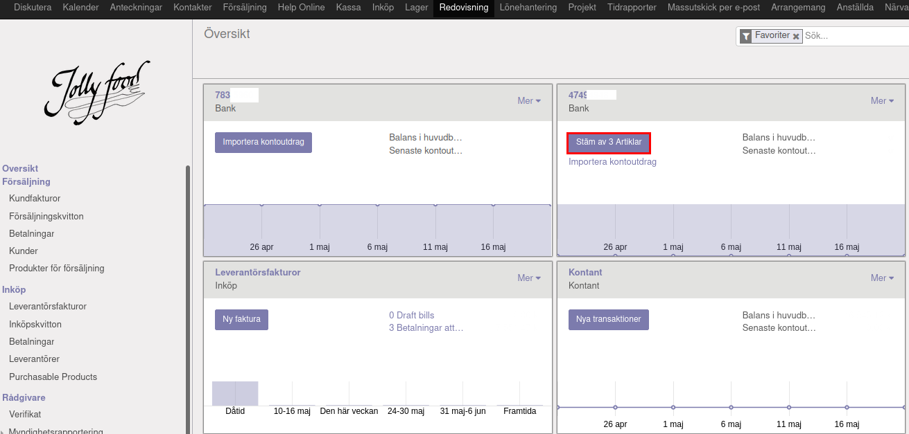
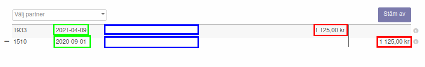
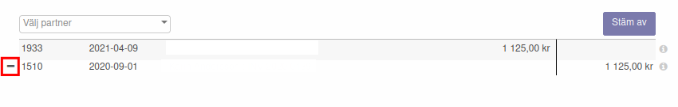
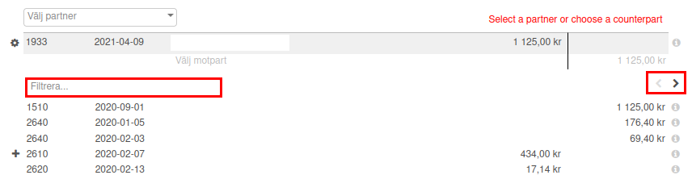
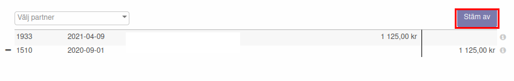
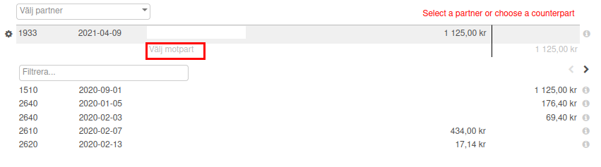
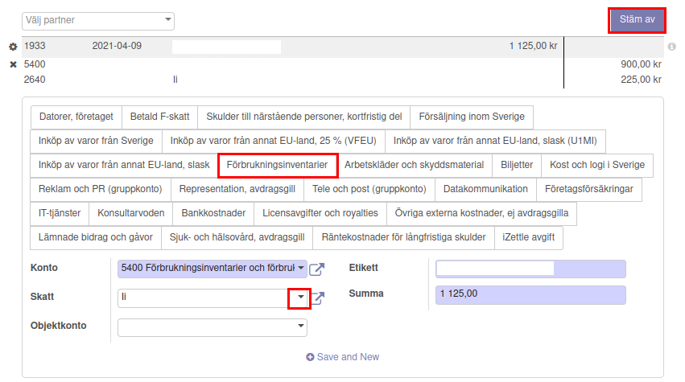

.. _localorexportsalestax:

========================================
Avstämning
========================================

För att göra en avstämning börjar man med att klicka sig in på “Stäm av artiklar” under “Översikt” 

Vid avstämningarna finns det huvudsakligen 3 saker att kolla att de stämmer: Kund (markerat med blått), Summa (markerat med rött) och Datum (markerat med grönt). 

Om allting verkar stämma klickar man på “Stäm av” uppe I högra hörnet.

.. image:: images/avstämning3.png
    :scale: 80 %

Om någon av sakerna inte stämmer överrens så tar man bort motparten genom att klicka på minustecknet på till vänster om motparten.

För att leta reda på en matchande motpart går det att söka efter exempelvis en specifik kund om man klickar på “Filtrera…”. Om rätt datum och betalning inte dyker upp kan man klicka på pilarna på höger sida för att hitta rätt datum och belopp (de är sorterade efter stigande datum, så de som har skapats nyligen kräver troligen några klick åt höger för att hitta).

Om man hittar rätt motpart kan man sedan klicka på “Stäm av” uppe I högra hörnet.

Om det inte går att hitta rätt motpart i listan men man vet att den borde finnas i systemet kan man börja med att rätta det felaktiga verifikatet. Det kan även vara bra att kolla igenom exempelvis kvitton för att se om transaktionen finns dokumenterad någonstans. 
Om transaktionen inte kan hittas någonstans kan man skapa ett nytt verifikat genom att göra följande:
Klicka på “Välj motpart” för att få upp förslag på ett antal olika transaktioner. 

Här kan man leta efter vilken typ av transaktion som verifiktatet ska beröra. I det här fallet valde vi “Förbrukningsinventarier”. 
När man har klickat på en kategori fylls automatiskt “Konto” “Skatt” “Etikett” och “Summa” i. Dubbelkolla så att rätt moms har valts. Om “Ii” är inkorrekt kan man klicka på den lilla pilen för att ändra till en annan momssats. När allting ser korrekt ut klickar man på “Stäm av” uppe till höger för att skapa verifikatet och stämma av det mot den befintliga transaktionen.

