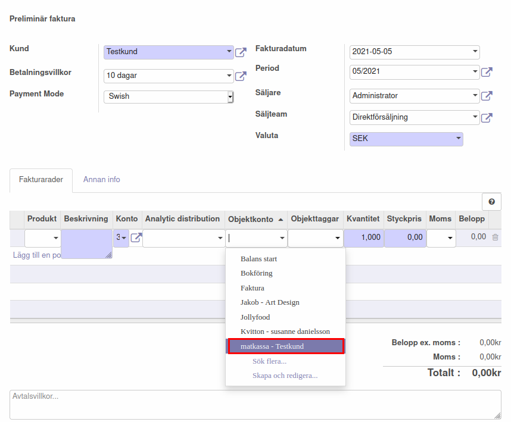
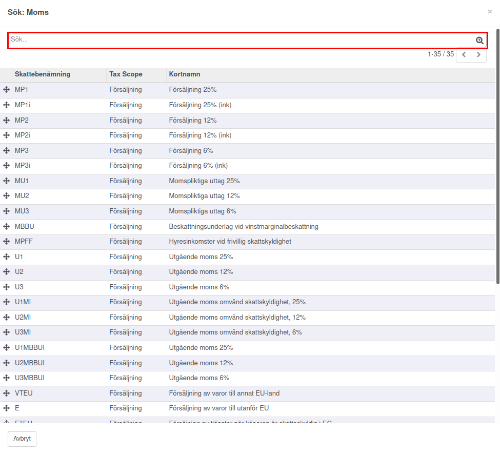
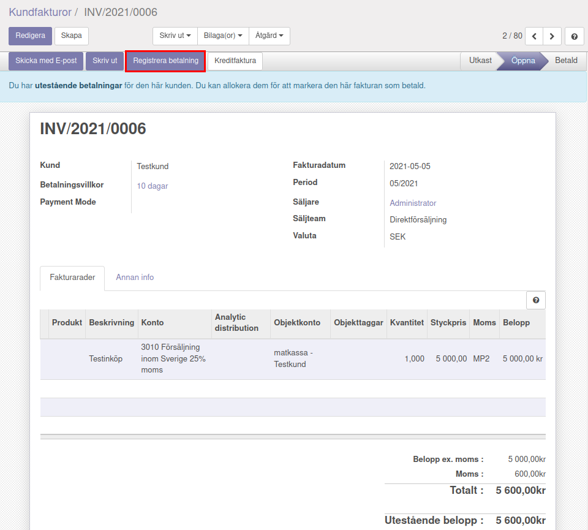

.. _localorexportsalestax:

========================================
Matkassan. Köpa och bokföra mat i affäsrverksamheten för kunds räkning.
========================================

Fakturera
------------

När en faktura skapas kan den kopplas till ett objektkonto. Detta görs enligt följande steg: Under “Kundfakturor” som man hitar på vänster sida under “Försäljning” skapas en ny faktura genom att klicka på “Skapa”.

    
Efter att ha fyllt I kundinformation, betalningsvillkor mm. Kan man klicka på “Lägg till en post”.

För att koppla fakturan till ett objektkonto klickar man under “Objektkonto” där flera förslag på befintliga objektkonton dyker upp. 

Välj det konto som fakturan ska kopplas till. Om det konto som eftersöks inte finns bland förslagen går det att klicka på “Sök flera”. 

.. image:: images/fakturering4.png
    :scale: 80 %

Då dyker alla objektkonton upp och det går enkelt att söka efter det önskade kontot.

.. image:: images/fakturering5.png
    :scale: 80 %
    
När objektkonto har valts så är det bara att skriva in “Kvanitet”, “Styckpris” och välja vilken momssats som ska användas. Flera förslag på momssatser dyker upp om man klickar på pilen under moms.

    
Här går det att välja någon av de momssatser som syns I listan eller så går det att klicka in på “Sök flera” för att få upp en lista över fler momssatser.
    
.. image:: images/fakturering7.png
    :scale: 80 %
    

I detta exempel valde vi “matkassa” som objektkonto, vi valde att varje ”enhet” kostar 1 krona och sedan får man fylla på med så många enherer som man har kommit överens att köpa mat för. (vilket var 800kr I det här fallet). I den här fakturan valdes exempelvis momssats MP2i, vilket innebär att moms ingår I priset. Momsen för MP2i är 12% vilket vadldes för att inköpet berör matinköp. 

Momsen kan man administrera på två sätt. Antingen inkluderar man momsen i priset eller så tillkommer momsen på priset.
Ska momsen tillkomma på det angivna priset väljer man exempelvis MP2 eller vill man att det angivna priset ska vara inklusive momsen väljer man exempelvis MP2i. “i” står alltså för inklusive moms.  

Vill man lägga till fler poster kan man göra det genom att klicka på “Lägg till en post” och sedan fylla I informationen på liknande sätt som för den första posten.
    

   
Under “Annan info” går det Exempelvis att ställa in Skatteregion, Journal, Konto eller Bankkonto. “Referens/Beskrivning” kan fyllas I med en egen anteckning för att lättare kunna se exempelvis vilken kund som det berör, eller något annat valfritt. Fakturan kan sedan skapas genom att klicka på “Spara”.
    
.. image:: images/fakturering10.png
    :scale: 80 %

Momsbeteckningar
------------

För att se vad de olika momsbeteckningarna innebär utan att behöva skapa en ny faktura går det att klicka på “Moms” som ligger under “Konfiguration” och “Redovisning” I den vänstra spalten. Man kan behöva scrolla ner för att hitta rätt rubrik.

.. image:: images/fakturering11.png
    :scale: 80 %

Registrera betalning
------------

För att registrera en betalning kan man göra enligt följande:

Välj den faktura som ska avbetalas.

.. image:: images/fakturering12.png
    :scale: 80 %

Klicka på ”Registrera betalning” för att välja betalsätt.

    
När man har klickat på "Registrera betalning får man välja mellan olika betalstätt. Det första alternativet (som delvis är anonymiserat i den här bilden) är Bankgirot som kan vara aktuell som betalningsmetod. Det andra alternaivet (som också är delvis anonymiserat i bilden) är bankkontot som sällan är aktuellt i det här sammanhanget. Swish och iZettle förutsätter att man har avtal med dessa tjänster för betalning.

.. image:: images/fakturering14.png
    :scale: 80 %
    
När man är nöjd kan man klicka på "Bekräfta" för att registrera betalningen. (I det här fallet valdes Swish som betalmetod).
    
.. image:: images/fakturering15.png
    :scale: 80 %
    
Fakturan blir då markerad som "Betald"
    
.. image:: images/fakturering16.png
    :scale: 80 %
      
För att kolla betalningsinformationen kan man klicka på "i"-ikonen i den betalda fakturan.
    
.. image:: images/fakturering17.png
    :scale: 80 %

