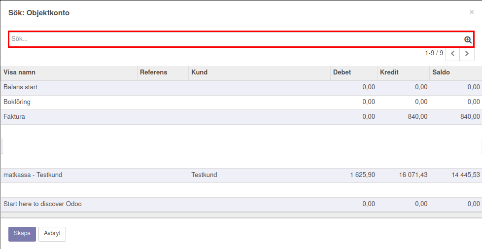
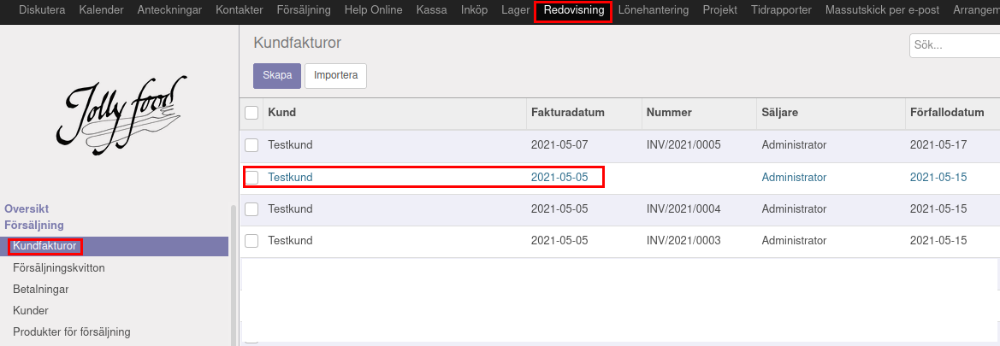
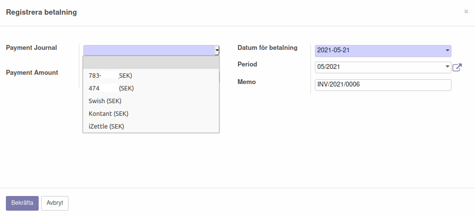
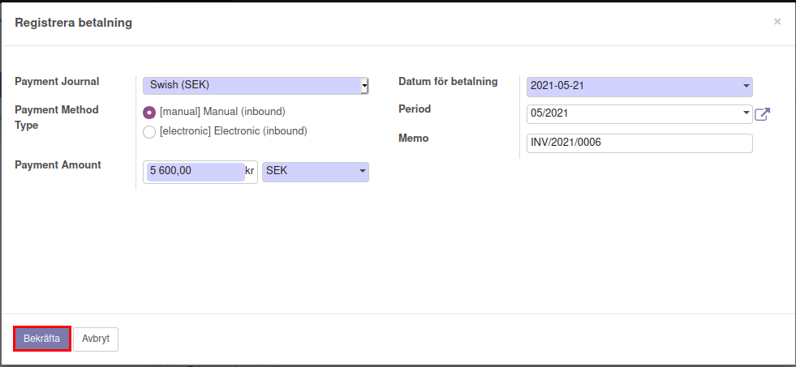
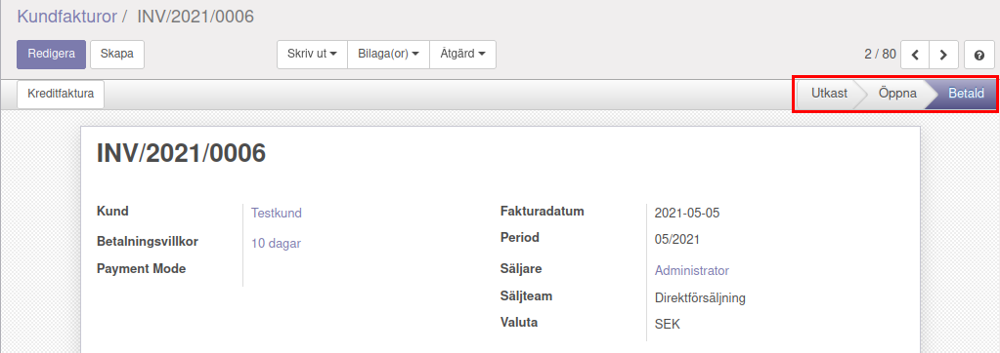

.. _localorexportsalestax:

========================================
Matkassan. Köpa och bokföra mat i affäsrverksamheten för kunds räkning.
========================================

Fakturering
------------
Det finns ett par olika sätt att hantera faktureringen beroende på om man har skapat produkter eller inte. Först presenteras fakturering utan produkt längre ner  presenteras fakturering med produkt.

Fakturering utan produkt
 Fakturering utan produkt görs enligt följande steg: Under “Kundfakturor” som man hittar på vänster sida under “Försäljning” skapas en ny faktura genom att klicka på “Skapa”.

.. image:: images/fakturering1.png
    :scale: 80 %
    
 Efter att ha fyllt i kundinformation, betalningsvillkor mm. Kan man klicka på “Lägg till en post”.

.. image:: images/fakturering2.png
    :scale: 80 %

 För att koppla fakturan till ett objektkonto klickar man under “Objektkonto” där flera förslag på befintliga objektkonton dyker upp. 

.. image:: images/fakturering3.png
    :scale: 80 %

 Välj det konto som fakturan ska kopplas till. Om det konto som eftersöks inte finns bland förslagen går det att klicka på “Sök flera”. 

 Då dyker alla objektkonton upp och det går enkelt att söka efter det önskade kontot.

    
 När objektkonto har valts så är det bara att skriva in “Kvanitet”, “Styckpris” och välja vilken momssats som ska användas. Flera förslag på momssatser dyker upp om man klickar på pilen under moms.

.. image:: images/fakturering6.png
    :scale: 80 %
    
 Här går det att välja någon av de momssatser som syns i listan eller så går det att klicka in på “Sök flera” för att få upp en lista över fler momssatser.
    

    
.. image:: images/fakturering8.png
    :scale: 80 %

 I detta exempel valde vi “matkassa” som objektkonto, vi valde att varje ”enhet” kostar 1 krona och sedan får man fylla på med så många enherer som man har kommit överens att köpa mat för. (vilket var 800kr I det här fallet). I den här fakturan valdes exempelvis momssats MP2i, vilket innebär att moms ingår I priset. Momsen för MP2i är 12% vilket vadldes för att inköpet berör matinköp. 

 Momsen kan man administrera på två sätt. Antingen inkluderar man momsen i priset eller så tillkommer momsen på priset.
 Om momsen ska tillkomma på det angivna priset väljer man exempelvis MP2 eller vill man att det angivna priset ska vara inklusive momsen väljer man exempelvis MP2i. “i” står alltså för inklusive moms.  

 Vill man lägga till fler poster kan man göra det genom att klicka på “Lägg till en post” och sedan fylla I informationen på liknande sätt som för den första posten.
    
.. image:: images/fakturering9.png
    :scale: 80 %
   
 Under “Annan info” går det Exempelvis att ställa in Skatteregion, Journal, Konto eller Bankkonto. “Referens/Beskrivning” kan fyllas I med en egen anteckning för att lättare kunna se exempelvis vilken kund som det berör, eller något annat valfritt. Fakturan kan sedan skapas genom att klicka på “Spara”.
    

    

Fakturering med produkt
------------    

Fakturering med produkt kräver lite mer tid än fakturering utan produkt den första gången man ska fakturera för att skapa en produkt, men underlättar faktureringen av samma produkt vid varje efterföljande fakturering eftersom en del information automatiskt kommer att fyllas i. Att fakturera med produkt rekommenderas därför att göras för varor och tjänster som ofta faktureras. Inledningsvis börjar man med att skapa en produkt 

Skapa produkt
 För att skapa en produkt kan man börja med att klicka sig in på “Produkter för försäljning” under “Försäljning“ i vänstra kolumnen.
 Bild 1

 Sedan klickar man på ”Skapa” uppe till vänster för att skapa en ny produkt.
 Bild 2

 Det finns då flera saker som kan fyllas i där de obiligatoriska fälten är blå.  ”Produktnamn” ”Produkttyp” och ”Intern kategori” är obligatoriska att fylla i. Välj ett lämpligt produktnamn (i det här exemplet väljer vi produktnamnet ”Matkassa”), samt vilken produkttyp och interna kategori den tillhör. För ”Produkttyp” kan man välja mellan ”Förbrukningsvara”, ”Tjänst” och ”Lagerförd artikel”, välj den produkttyp som är lämpligast för den valda produkten. För ”Intern kategori” går det att välja på en befintlig kategori i listan som kommer upp eller genom att klicka på ”Sök flera…” 
 Bild X

 Om ingen av de befintliga kategorierna är passande kan man skapa en ny kateogri genom att klicka på ”Skapa och redigera…” 
 Bild X. 

 Efter att ha valt en befintlig kategori eller skapat en ny kategori finns det ett flertal andra saker som man kan sedan ställa in under flera olika flikar. En av de viktigaste flikarna att ställa in för att underlätta faktureringen är  fliken ”Fakturering”. Här kan man bland annat ställa in vilket intäktskonto som ska användas samt vilken skatt som ska knytas till kunden. 
 Bild X

 När man har fyllt i den information man vill kan man sedan spara produkten genom att klicka på ”Spara” uppe till vänster. 
 Bild X.

Skapa kundfaktura
 När man sedan ska skapa en ny kundfakura gör man inledningsvs på liknande sätt som för fakturering utan produkt.
 Klicka in på ”Kundfakturor” under ”Försäljning” i vänstra kolumnen och skapa en ny faktura genom att klicka på ”Skapa” Bild X

 Efter att ha fyllt i kundinformation, betalningsvillkor mm. Kan man klicka på “Lägg till en post”. 
 Bild X

 Istället för att börja fylla i saker manuellt börjar man här istället med att välja en produkt genom att klicka på rutan under ”Produkt”. Några olika alternativ på produkter kommer upp i listan, om ingen av de produkter som visas är den som eftersöks kan man klicka på ”Sök flera…” för att få upp en större lista över produkter där man kan söka efter sin produkt. 
 Bild X

 Alternativt kan man välja att skapa en ny produkt härifrån genom att klicka på ”Skapa och redigera…”. Då går man igenom samma steg som presenterades tidigare under rubriken ”Skapa produkt”.

 När en produkt har valts kommer flera fält automatiskt att fyllas i. Vilka fält som fylls i beror på vad som ställdes in när produkten skapades, där exempelvis ”Beskrivning”, ”Konto”, ”Styckpris” och ”Moms” kan vara ifyllda. Exempelvis kvantitet och styckpris kan behöva ändras beroende på vad som gäller för den specifika fakturan. 
 Bild X

 Om man vill använda sig av objektkonton behöver man välja det manuellt, vilket likt fakturering utan produkt görs genom att klicka på rutan och antingen välja ett objektkonto som visas direkt eller genom att klicka på ”Sök flera...”. 
 Bild X.

 När allting är ifyllt kan man spara fakturan genom att klicka på ”Spara” uppe till vänster. 
 Bild X
 
    

Momsbeteckningar
------------

För att se vad de olika momsbeteckningarna innebär utan att behöva skapa en ny faktura går det att klicka på “Moms” som ligger under “Konfiguration” och “Redovisning” I den vänstra spalten. Man kan behöva scrolla ner för att hitta rätt rubrik.

Registrera betalning
------------

För att registrera en betalning kan man göra enligt följande:

Välj den faktura som ska avbetalas.

Klicka på ”Registrera betalning” för att välja betalsätt.

.. image:: images/fakturering13.png
    :scale: 80 %
    
När man har klickat på "Registrera betalning får man välja mellan olika betalstätt. Det första alternativet (som delvis är anonymiserat i den här bilden) är Bankgirot som kan vara aktuell som betalningsmetod. Det andra alternaivet (som också är delvis anonymiserat i bilden) är bankkontot som sällan är aktuellt i det här sammanhanget. Swish och iZettle förutsätter att man har avtal med dessa tjänster för betalning.

    
När man är nöjd kan man klicka på "Bekräfta" för att registrera betalningen. (I det här fallet valdes Swish som betalmetod).
    

    
Fakturan blir då markerad som "Betald"
    

      
För att kolla betalningsinformationen kan man klicka på "i"-ikonen i den betalda fakturan.
    
.. image:: images/fakturering17.png
    :scale: 80 %

