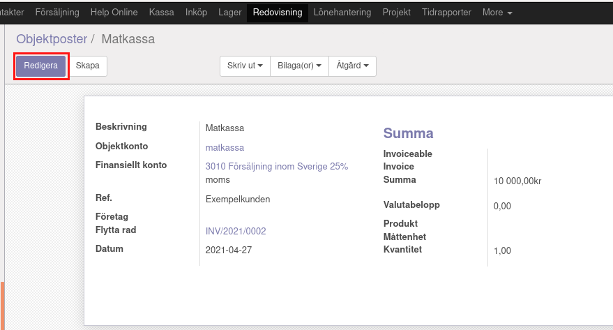
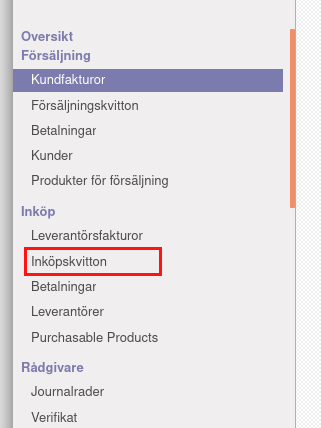

.. _localorexportsalestax:

.. index::
   single: Matkassan. Ett exempel när ett företag (kunden) beställer en tjänst, 
   att laga mat tillsammans, men uppdragsgivaren vill ha en "matkassa" att 
   köpa mat för i förskott.  

========================================
Matkassan. Köpa och bokföra mat i affäsrverksamheten för kunds räkning.
========================================

Objektpost, faktura och bokföring
-----------------------------------

Objektposter
    Under Redovisning, menyvalet Objektposter.
    
    Bekanta dig med Objektposter. Summera och ha kontroll på gemensamma kostnader och inkomst på samma ställe.

Faktura
    Välj objektkonto på fakturan.

Momssatser och 
    Välj objektkonto på fakturan.
    Dina utgifter

.. image:: images/matkassan_x01.png
    :scale: 80 %

Objektposter
    Jämför med vyn i din bokföring.

Objektposter
    Detaljer kan skilja.

.. image:: images/matkassan_x03.png
    :scale: 80 %

Fakturan
    I exemplet har vi valt att varje "enhet" kostar 1 krona och att man får fylla på med så många enherer som man har kommit överens att köpa mat för.
    
    Vi har valt "matkassa" som Objektkonto och momsen ska vara MP2i, vilket står för inkluderad. 
    
    Mat är 12% moms och plastbestick, plastmuggar och servetter är det 25% moms.
    
    Klicka till Redovisning i menyn, se Kundfakturor i vänstermarginalen.

.. image:: images/matkassan_01.png
    :scale: 80 %

.. image:: images/matkassan_02.png
    :scale: 80 %

.. image:: images/matkassan_03.png
    :scale: 80 %

Inköpskvitto
    I exemplet har vi valt att varje "enhet" kostar 1 krona och att man får fylla på med så många enherer som man har kommit överens att köpa mat för.

