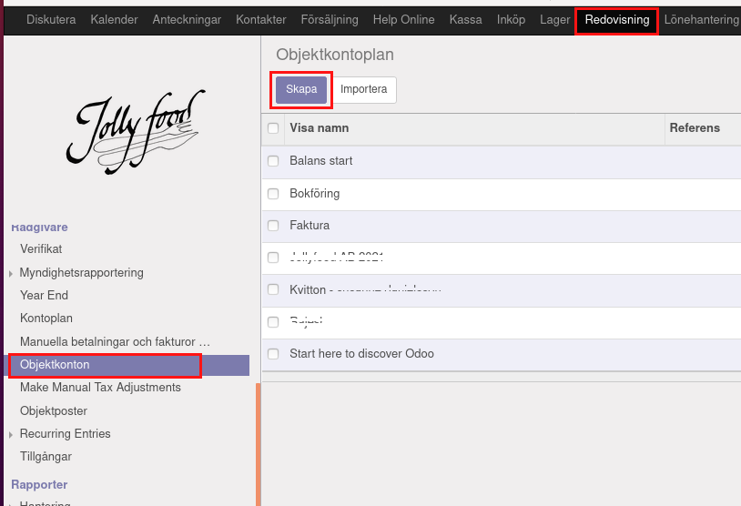
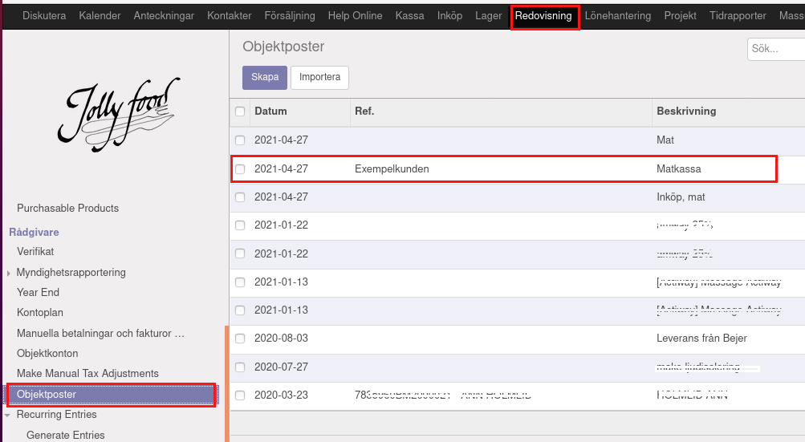

.. _localorexportsalestax:

.. index::
   single: Matkassan. Ett exempel när ett företag (kunden) beställer en tjänst, 
   att laga mat tillsammans, men uppdragsgivaren vill ha en "matkassa" att 
   köpa mat för i förskott.  

========================================
Matkassan. Köpa och bokföra mat i affäsrverksamheten för kunds räkning.
========================================

Planerade inköp
------------

Fakturera
    Fakturera kunden för kommande inköp.

Objektkonto och moms
    Poängen med objektkonto är att få överblick av konstnader kopplade till en viss händelse eller åtgärd som man själv väljer ett lämpligt namn på. 
    
    Momsen kan man administrera på två sätt. Antingen inkluderar man momsen i priset eller så tillkommer momsen på priset.
    
    Ska momsen tillkomma på det angivna priset väljer man MP2 eller vill man att det angivna priset ska vara inklusive momsen väljer man MP2i.

Administrera objektkonto
    Redovisning > Konfiguration > Objektkonto
    
    Här administrerar du dina konton. De kan vara kopplade till en viss kund eller till ett visst projekt eller för att få överblick av kostnaden för en viss aktivitet.

.. image:: images/matkassan2_03.png

.. image:: images/matkassan2_04.png

Objektkonto
------------

Objektkonto
    Under Redovisning, menyvalet Objektposter.

Objektkontoplan / ny
    Här ställer man in kund och referens.

Objektpost, faktura och bokföring
-----------------------------------

Objektposter
    Under Redovisning, menyvalet Objektposter.
    
    Bekanta dig med Objektposter. Summera och ha kontroll på gemensamma kostnader och inkomst på samma ställe.

Faktura
    Välj objektkonto på fakturan.

Momssatser och 
    Välj objektkonto på fakturan.
    Dina utgifter

Objektposter
    Jämför med vyn i din bokföring.

.. image:: images/matkassan_x02.png
    :scale: 80 %

Objektposter
    Detaljer kan skilja.

Fakturan
    I exemplet har vi valt att varje "enhet" kostar 1 krona och att man får fylla på med så många enherer som man har kommit överens att köpa mat för.
    
    Vi har valt "matkassa" som Objektkonto och momsen ska vara MP2i, vilket står för inkluderad. 
    
    Mat är 12% moms och plastbestick, plastmuggar och servetter är det 25% moms.
    
    Klicka till Redovisning i menyn, se Kundfakturor i vänstermarginalen.

Inköpskvitto
    I exemplet har vi valt att varje "enhet" kostar 1 krona och att man får fylla på med så många enherer som man har kommit överens att köpa mat för.

.. image:: images/matkassan_04.png
    :scale: 80 %

Bokföring
    När du gjort ditt matinköp fotar du kvittot som verifikat och lägger in inköpet i Odoo.

Bokföring
    Du har varit på Coop och köpt mat kontant.

Bokföring
    Här skriver du in ditt inköp i Odoo.

