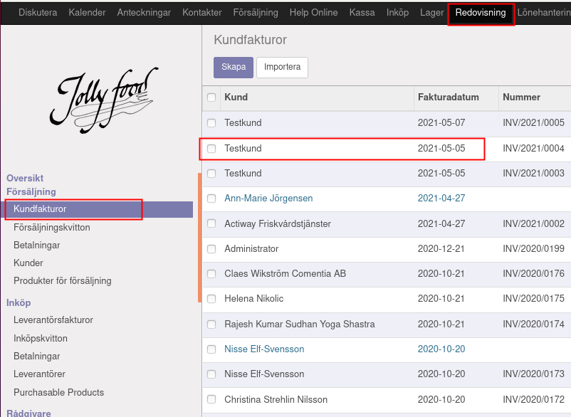
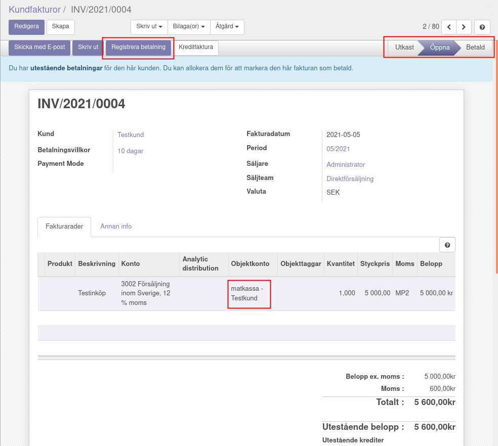
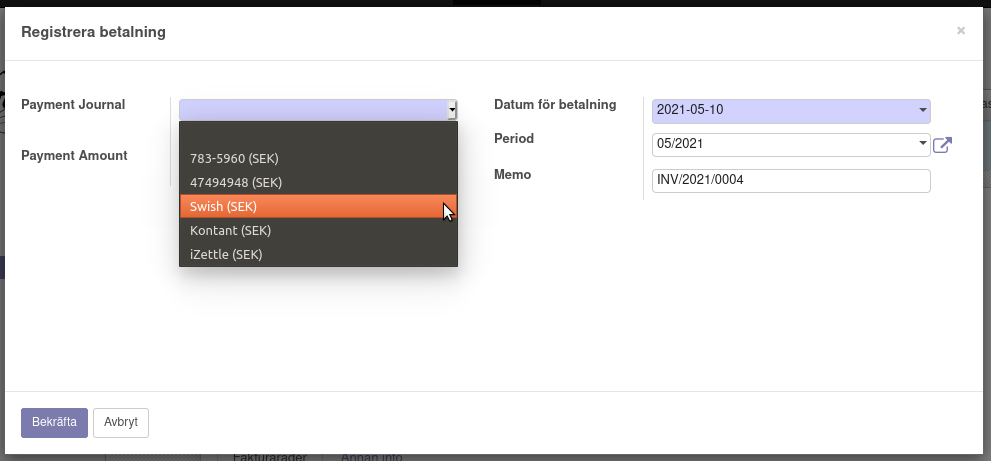
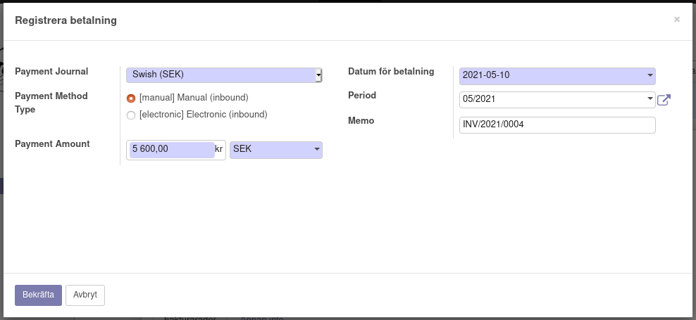
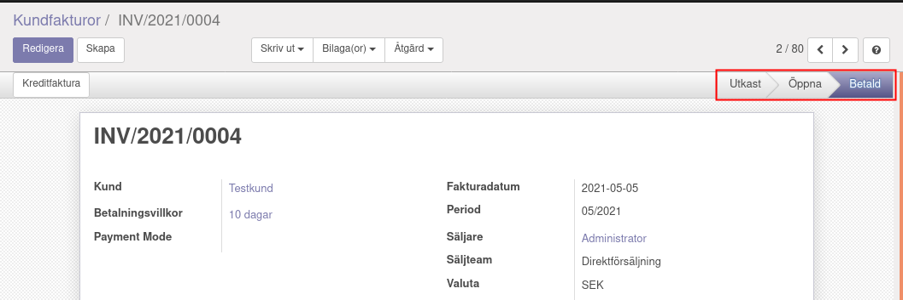
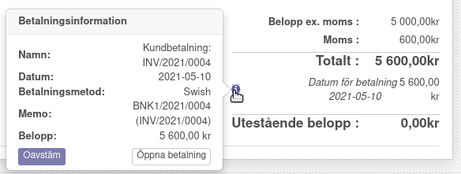

.. _localorexportsalestax:

.. index::
   single: Matkassan. Ett exempel när ett företag (kunden) beställer en tjänst, 
   att laga mat tillsammans, men uppdragsgivaren vill ha en "matkassa" att 
   köpa mat för i förskott.  

========================================
Matkassan. Avräkna kvitto mot matkassan.
========================================

Planerade inköp
------------

Fakturera kunden för kommande inköp.
    I detta exemplet fakturerar vi kunden i förskott.

Vi har markerat på fakturan, "matkassa - Testkund", att summan går att räkna av mot. MP2 är 12% moms på livsmedel / mat.

Klicka på "Registrera betalning" för att välja betalsätt.

Olika betalsätt.

När du är nöjd trycker du på Bekräfta.

Fakturan blir markerad Betald.

Genom att hålla musen över "i" kan man se Betalinformation.

