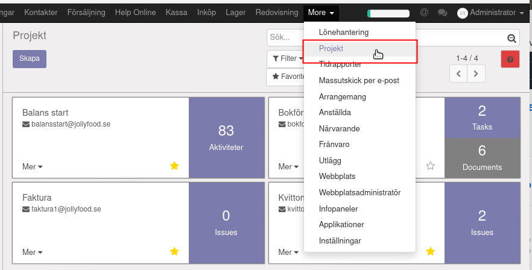
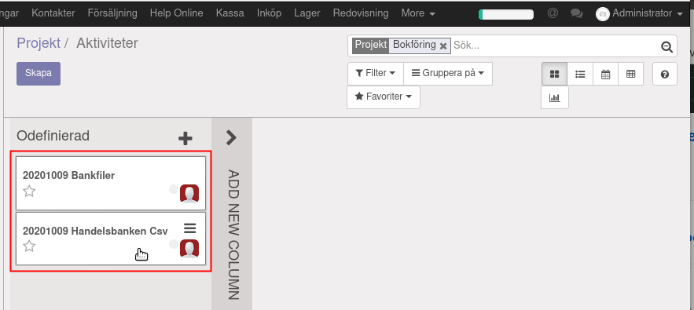
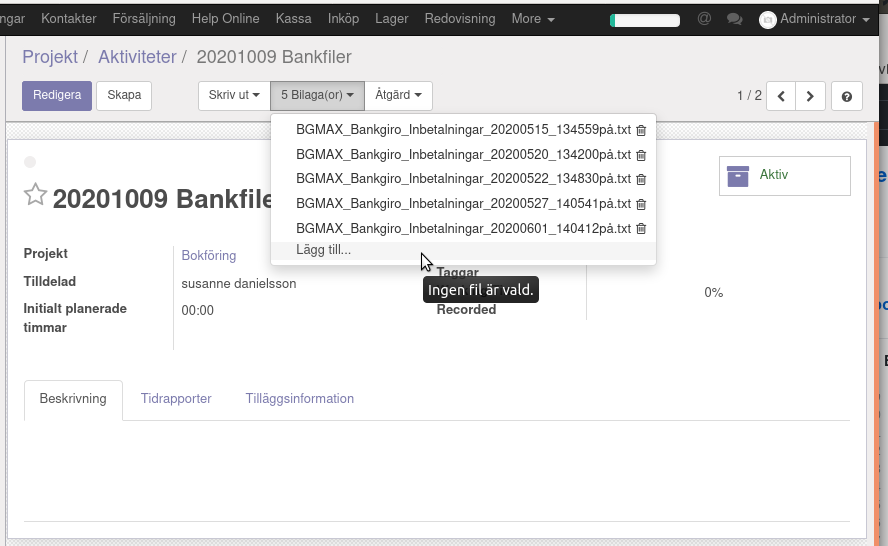
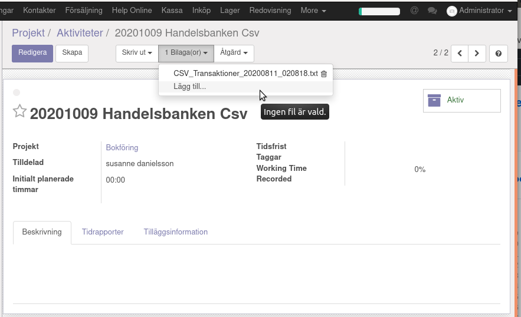

.. _localorexportsalestax:

.. index::
   single: Matkassan. Ett exempel när ett företag (kunden) beställer en tjänst, 
   att laga mat tillsammans, men uppdragsgivaren vill ha en "matkassa" att 
   köpa mat för i förskott.  

========================================
Matkassan. Verifiera betalning.
========================================

Bokföring.
------------

Ladda bankfilen.
    Under mappen Projekt finns plats för att ladda upp dokument från banken.

Bankfiler
    Här ska det finnas två projekt att klicka på. Den ena är för inbetalningar till BankGirot, den andra är för all aktivitet på bankkontot.

BankGirot
    Ladda upp alla inbetalningar med BankGirot under den gångna månaden.

Handelsbanken, Swedbank, Nordea
    Fil från din bank för månadens transaktioner.

