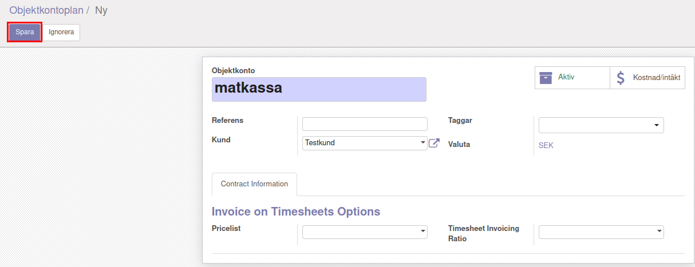

.. _localorexportsalestax:

.. index::
   single: Matkassan. Ett exempel när ett företag (kunden) beställer en tjänst, 
   att laga mat tillsammans, men uppdragsgivaren vill ha en "matkassa" att 
   köpa mat för i förskott.  

========================================
Matkassan. Köpa och bokföra mat i affäsrverksamheten för kunds räkning.
========================================

Objektkonto
------------

Poängen med objektkonto är att få överblick av konstnader kopplade till en viss händelse eller åtgärd som man själv väljer ett lämpligt namn på

Under “Redovisning” finns det på vänster sida ett menyval under rubriken “Rådgivare” som heter “Objektkonton”. Där går det att se befintliga objektkonton och skapa nya. 

För att skapa nya objektkonto klickar man på skapa uppe till vänster. 

När man klickat på “Skapa” kan man exempelvis ställa in namnet på objektkontot, kund och referens. 

När man är nöjd med sina ifyllningar kan man spara objektontot genom att klicka på “Spara” uppe I vänstra hörnet. 

Alternativt kan man klicka in på en befintlig kund och sedan klicka på redigera för att kunna ändra I obejktkontot.

När man har redigerat färdigt klickar man på “Spara” uppe I vänstra hörnet.

Uppföljning
-----------------------------------

För att kontrollera att allting är korrekt på obejktkontot kan man välja “Objektonton” I vänster meny och sedan klicka in på ett objektkonto. 

Bild 6. 

Väl inne I objekkontoto kan man klicka på “Kostnad/intäkt” uppe till höger för att se kontots balans, förutsatt att objektkontot har hunnit användas.

Objektposter
   
På vänster sida under “Rådgivare” finns det också ett  menyval för “Objektposter”. Under “Objektposter” går det att se en överblick över vilka intäkter och kostnader som är kopplade till olika Objektkonton. Bild 9. 

Objektposter
    Detaljer kan skilja.

