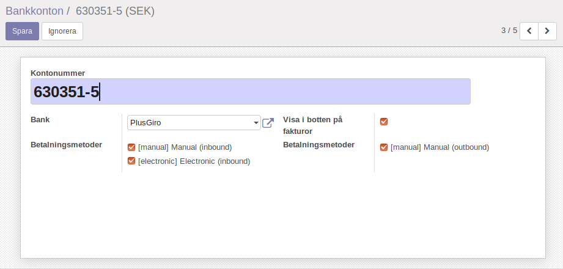
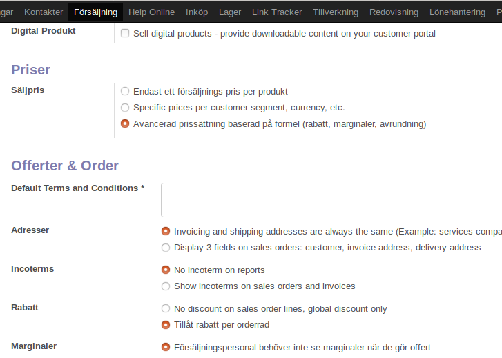

======================
Konfigurering
======================

.. note:: I detta exempel beskriver menar vi att vardagsarbetet är det som normalt sker på företaget; konsulterna planerar   projekt och rapporterar timmar och förbrukat material, säljare skickar offerter och tar emot och effektuerar ordrar, lagerpersonal leverar ut och tar emot varor, inköpare köper in varor (osv), dvs de arbetsuppgifter som inte är direkt kopplat till bokföring. I avsnittet "Bokförarens vardag" går vi igenom arbetet med att göra bokföring i Odoo och hur Odoo skapar bokföringsunderlag. 

|image0|

======================
Rabatt
======================
Det finns två sätt att ge rabatter vid ett köp. Man kan skapa olika prislistor och man kan inkludera rabatten i samband med köp. Då visas rabatten prydligt på offerten eller på fakturan.

Menyval: Försäljning > Konfiguration > Inställningar. Se bild nedan. Gör dessa två val, tryck Verställ för ändringar att aktiveras.

Välj Säljpris > Avancerad prissätting...

Välj Rabatt > Tillåt rabattrad per orderrad.

|image1|

======================
Väntetider
======================
Fråga: Över fyra minuter per uppdatering är rätt bökigt. ”Lämna inte skärmen än..." Finns det något sätt att snabba på uppdateringar i databasen?

I 9 fall av 10 beror långsamma svarstider på klienten och inte servern. En långsam dator och om man har många fönster öppna samtidigt.

======================
Skicka faktura
======================
Fråga: Fram till dess vi migrerat webbsidorna är det så att jag skall ladda ner fakturorna och maila dem från oss?

Nej, du behöver inte vänta på hemsidan. Du kan skicka faktura direkt från servern vi har gjort i ordning för dig. Det är viktigt att dina uppgifter stämmer, med BankGiro, PlusGiro, adress och telefonnummer. Kunderna fyller du i med namn, adress och e-post och sen kan du skapa och skicka faktura i systemet.

