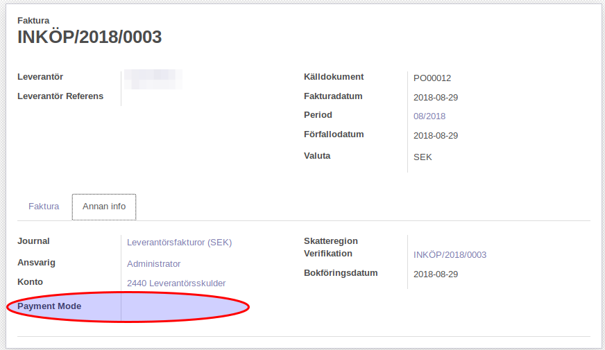
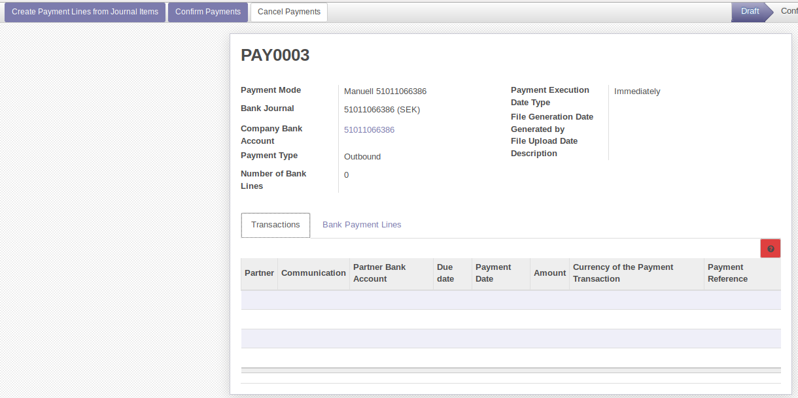
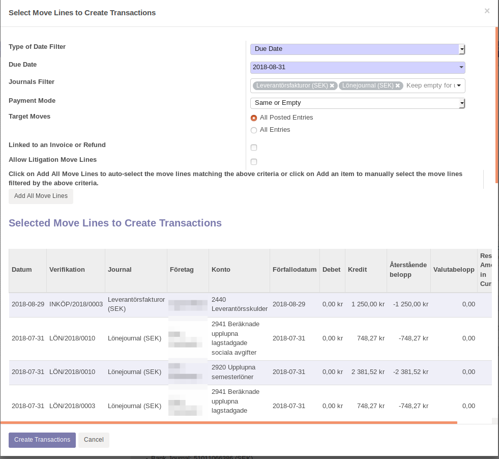
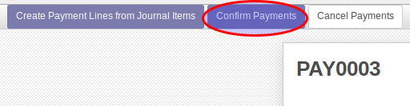
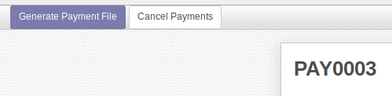
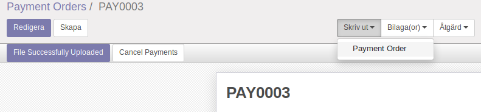

.. _payment_order:

.. index::
   single: Betalorder

======================
Skapa betalningsuppdrag
======================

Vid skapande av en leverantörsfaktura kan man ange en betalningsmetod (Payment Mode). Det är inte nödvändigt att använda detta om man ej har flera betalmetoder och vill kunna specificera hur en viss faktura ska betalas. När fakturan godkänns följer betalningsmetoden med till verifikatet.

Gå till **Redovisning** > **Payments** > **Payment Orders** för att skapa en ny betalorder.

Efter val av betalningsmetod (1) är det möjligt att byta journal (2) och betaldatum (3). Du kan välja mellan att betala omedelbart, på respektive förfallodatum, eller specificera ett datum. Tryck på knappen *Create Payment Lines from Journal Items* för att söka efter verifikatrader som ska betalas.
 

I denna dialogruta specificerar man ett filter för att leta fram de verifikatrader som man vill skapa betalningar av.

Använd *Type of Date Filter* (1) för att välja vilket datum på verifikatraderna som ska matchas mot betalorderns datum; förfallodatum eller fakturadatum.
Fyll i önskat datum i *Due Date* / *Move Date* (2).
Välj vilka journaler som verifikatraderna ska hämtas från med *Journals Filter* (3).
*Payment Mode* (4) bestämmer om transaktioner ska matchas mot betalorderns betalmetod. *Same* ger en enbart de transaktioner som har samma betalmetod som betalordern. Om man ej markerat sina fakturor/verifikat med en betalmetod så bör man välja *Same or Empty* eller *Any*.
Klicka på *Add Move Lines* (5)för att lägga till alla oavstämda, matchande verifikatrader.
Om det saknas verifikat så kan man lägga till dem manuellt, via *Lägg till post* (6).
Klicka på *Create Transactions* (7) för att skapa betaltransaktioner.

Klicka på *Confirm Payments*.

Klicka på *Generate Payment File*.

Om man valt en manuell betalningsmetod så får man inte ut någon fil. Då kan man skriva ut betalningsinstruktionerna genom att klicka på knappen *Skriv ut* och välja *Payment Order*.

PDF:en innehåller rader som beskriver vilka betaluppdrag som ska genomföras i internetbank el. dyl.

