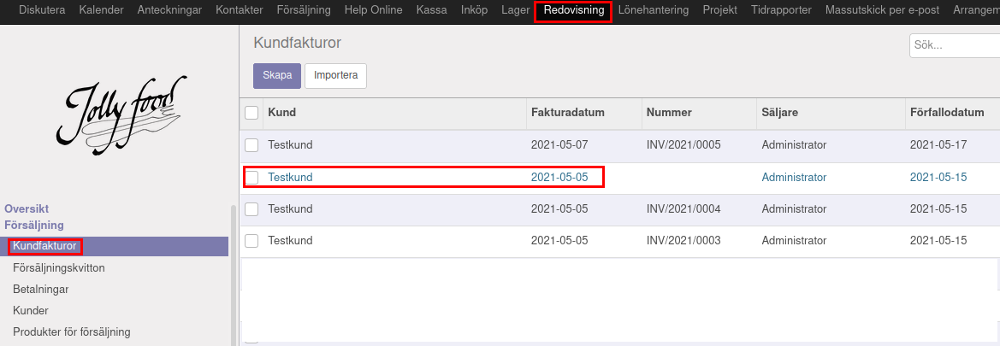
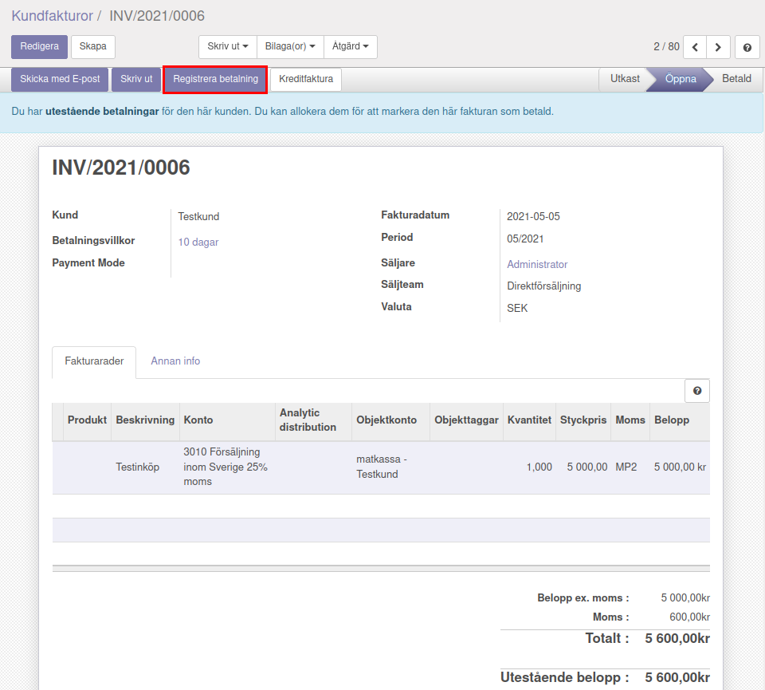
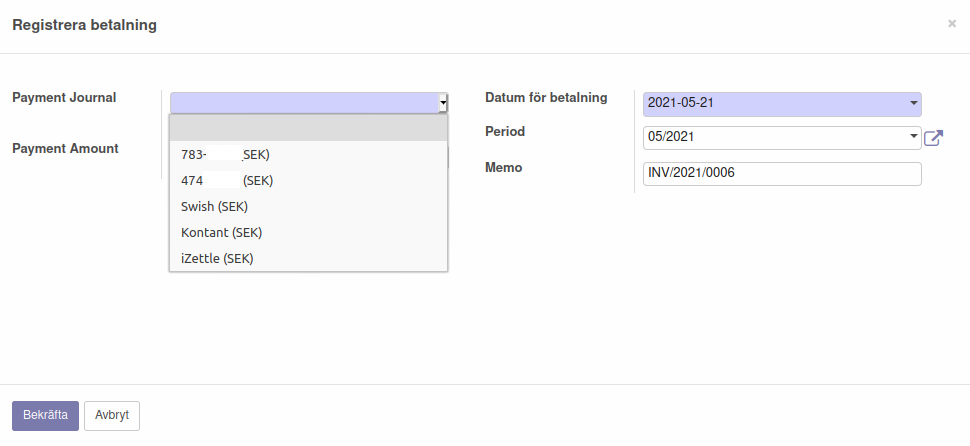
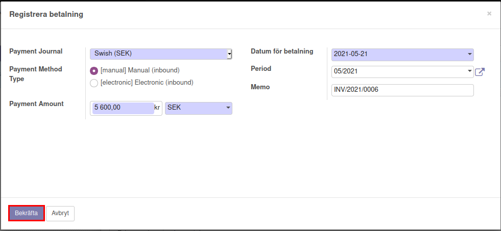
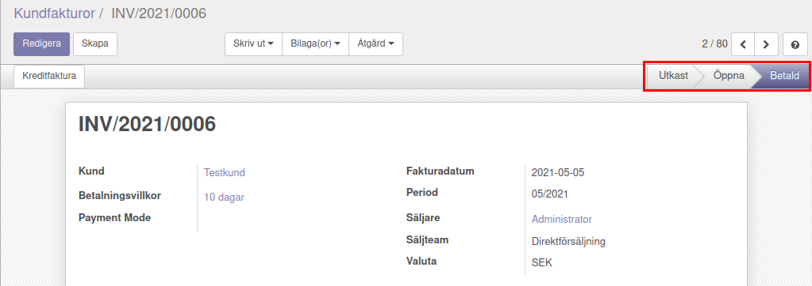
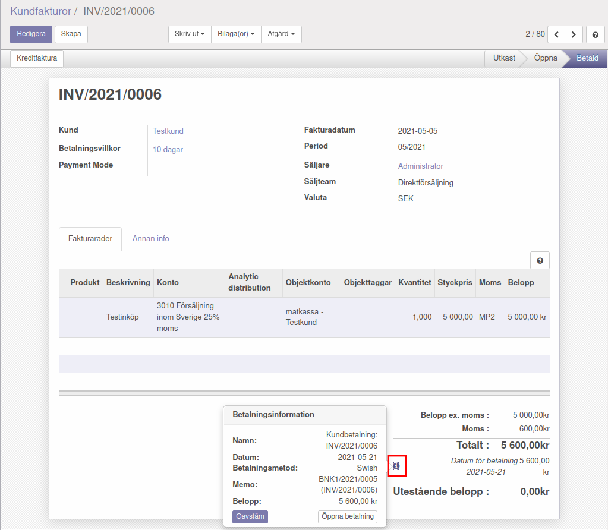

.. _localorexportsalestax:

========================================
Registrera betalningar
========================================

För att manuellt registrera en betalning kan man göra enligt följande:

Välj den faktura som ska avbetalas.

Klicka på ”Registrera betalning” för att välja betalsätt.

    
När man har klickat på "Registrera betalning får man välja mellan olika betalstätt. Det första alternativet (som delvis är anonymiserat i den här bilden) är Bankgirot som kan vara aktuell som betalningsmetod. Det andra alternaivet (som också är delvis anonymiserat i bilden) är bankkontot som sällan är aktuellt i det här sammanhanget. Swish och iZettle förutsätter att man har avtal med dessa tjänster för betalning.

    
När man är nöjd kan man klicka på "Bekräfta" för att registrera betalningen. (I det här fallet valdes Swish som betalmetod).
    

    
Fakturan blir då markerad som "Betald"
    

      
För att kolla betalningsinformationen kan man klicka på "i"-ikonen i den betalda fakturan.
    

