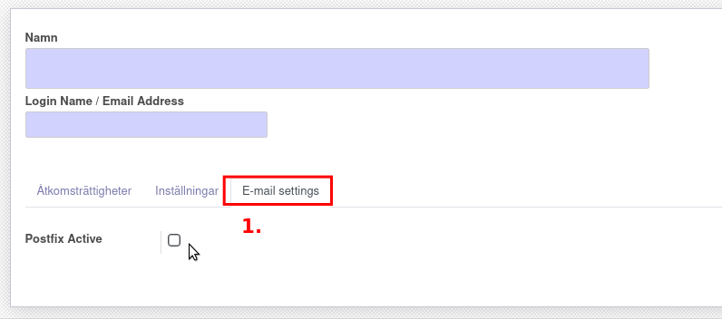
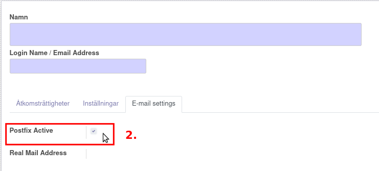

.. _usersindex:

.. index::
   single: User management

======================
Administrera användare
======================

Hantera användare
------------------------
Som administratör kan du hjälpa dina kollegor att komma igång både med att logga in på hemsidan och att få tillgång till e-post på din webbplats.

.. image:: img/users_guide_01.png
   :align: left

| 
| 

Skapa användare
------------------------
Inställningar > Skapa

.. image:: img/users_guide_02.png
   :align: left

| 
| 

Postfix Active
------------------------
Klicka på fliken Email settings och markera rutan.

| 
| 

Viktigt!
------------------------
Fyll i den tänkta e-postadressen som ska vara på din domän.

.. image:: img/users_guide_05.png
   :align: left

| 
| 

"Real Mail Address"
------------------------
Det är viktigt att e-postadressen är utskrived enligt bilden nedan.

.. image:: img/users_guide_06.png
   :align: left

| 
| 

Kontakter
------------------------
Skapa en ny Kontakt

| 
| 

Förutom namnet...
------------------------
ska du marker "Individuell", koppla användaren till namnet på ditt företag, (Kodspecialisterna i detta exempel) samt fylla i e-postadressen.

