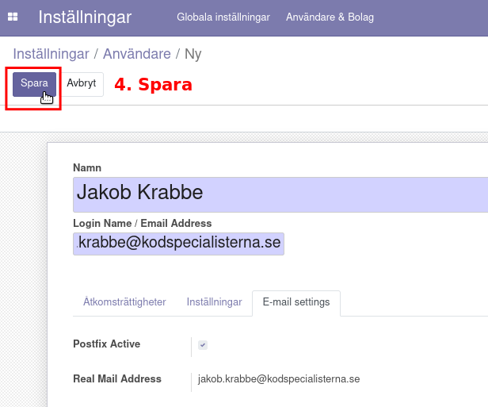

.. _usersindex:

.. index::
   single: User management

======================
Administrera användare
======================

Lägg till användare
------------------------
Som administratör kan du hjälpa dina kollegor att komma igång både med att logga in på hemsidan och att få tillgång till e-post på din webbplats.

Odoo skapar automatiskt alla verifikat bakom kulisserna för var och en av dina bokföringstransaktioner: kundfakturor, försäljningsorder, utgifter, lagerförflyttningar etc.

Verifikaten skapas på traditionellt sätt med regler för dubbel bokföring och använder i normala fall BAS-kontoplanen.

Periodiseringsmetoder och kassakrav
------------------------------
Odoo stöder både periodiserad och kontantbaserad rapportering. Detta gör att du kan redovisa intäkter / kostnader när transaktioner inträffar (dvs periodiseringsbas) eller när betalning görs eller erhålls (dvs. kontantbas).

.. image:: img/users_guide_01.png
   :align: left

.. image:: img/users_guide_02.png
   :align: left

.. image:: img/users_guide_03.png
   :align: center

.. image:: img/users_guide_04.png
   :align: center

.. image:: img/users_guide_05.png
   :align: center

