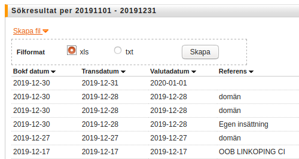
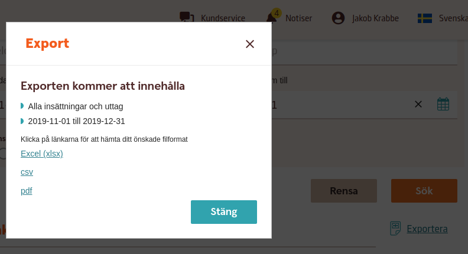

.. _accountingindex:

.. index::
   single: Accounting

======================
Vardag med Odoo
======================

.. note:: I detta exempel beskriver menar vi att vardagsarbetet är det som normalt sker på företaget; konsulterna planerar   projekt och rapporterar timmar och förbrukat material, säljare skickar offerter och tar emot och effektuerar ordrar, lagerpersonal leverar ut och tar emot varor, inköpare köper in varor (osv), dvs de arbetsuppgifter som inte är direkt kopplat till bokföring. I avsnittet "Bokförarens vardag" går vi igenom arbetet med att göra bokföring i Odoo och hur Odoo skapar bokföringsunderlag. 

Olika ansvarsområden
-----------------------
.. toctree::
   :maxdepth: 1
   
   /project/project.rst
   /kostnadsredvisning/index.rst
   X/project/issue.rst
   /sales/sale.rst
   /purchase/purchase.rst
   /inventory/stock.rst
   /manufacturing/mrp.rst
   X/ecommerce-and-website/ecommerce.rst

Annat vardagligt
-----------------------
.. toctree::
   :maxdepth: 1
   
   /human-resource/comeandgo.rst
   /human-resource/leaves.rst
   /human-resource/employee_expense.rst

Bokförarens vardag
-----------------------
.. note:: I detta exempel beskriver "Bokförarens vardag" som en parallell process skild från övriga affärsprocesser som drivs i Odoo. Vi går igenom hur bokföringsarbtet kan organiseras effektivt oavsett som det sker med egen personal eller en inhyrd byrå. Det innebär också att vi skiljer ut bank- och myndighetstransaktioner som även dessa utförs av personer med speciell behörighet. Det viktiga är att kunna fördela arbetsuppgifter på ett effektivt sätt som också överenstämmer med hur man önskar att driva företaget.

.. toctree::
   :maxdepth: 1
   
   /inaktsredovisning/index.rst
   /accounting/accounting.rst
   /accounting/payment_order.rst

* Löpande bokföring; bokför inköp, kvitton, representation, lön, hyra etc
* Genomför lönekörningar
* Skapar arbetsgivar- och momsdeklarationer
* Skapar betalningsuderlag för lön, leverantörer, skatt etc
* Stämmer av bankkonton (matcha leverantörsbetalningar, lön och andrakostnader), bankgiro (matcha kundfakturor),  kreditkort

Anslagstavlan
=================

* Bra saker att ha på sin anslagstavla

Myndighetsrapportering och bank
------------------------------
.. note:: I detta avsnitt beskriver vi den process som utgörs av myndighetsrapportering och kommunikation med banken. I många fall önskar man skilja på de personer som genomför t ex leverantörs- och löneutbetalningar på banken från de som tillvards gör bokföringen. Granskning av och inrapportering av arbetsgivar- och momsdeklaratrioner sker också ofta av en specifikt ansvarig personer på företaget även om det är möjigt att delegera ut det på t ex en byrå. Det viktiga är att kunna fördela arbetsuppgifter på ett effektivt sätt som också överenstämmer med hur man önskar att driva företaget.
 	accounting
* Tar ut avstämningsfiler från bank och kortutgivare
* Genomför betalningar
* Skickar in deklarationsfiler

Viktiga datum
----------------
.. toctree::
   :maxdepth: 2

   introduction.rst
   
.. hlist::
   :columns: 3

   * A list of
   * short items
   * that should be
   * displayed
   * horizontally

Anslagstavlan
=================

* Bra saker att ha på sin anslagstavla

Förbereda för drift.
=================

.. tip:: Nedan följer saker att tänka på för att göra iordning Odoo för drift. Det krävs varierande mängd förkunskaper för denna delen, men lite ska väl ändå de flesta förstå!

Bankfilen
----------------
Kunden ska ladda upp bankfilen 

I Swedbank, klassisk vy, väljer man "Sök transaktioner" och fyller i kontot och mellan vilka datum man vill ha. Klicka på länken "Skapa fil" och välj xls.

I den nya vyn i Swedbank finns csv som val att exportera.

