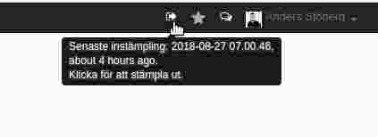

.. _hrindex:

==============
Komma och gå
==============

In och utstämpling sker via en ikon på indikatorraden i Odoo. Ett klick för instämpling och nästa klick stämplar ut. Närvaron matchas med schemat. Vid tidrapporteringen kan man även jämföra närvaro med registrerad tid.

Utöver in/ut-ikonen så finns det mobil app och möjlighet att sätta upp en in/ut-stämplingspanel i lokalerna.
