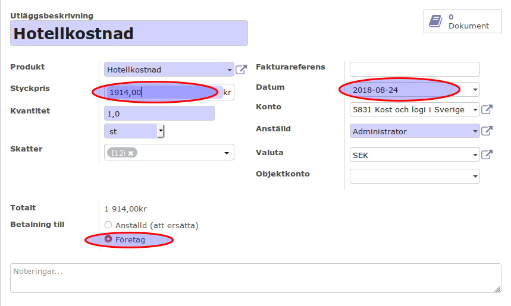
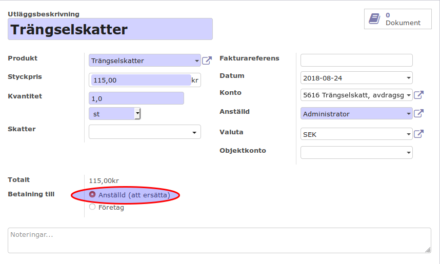
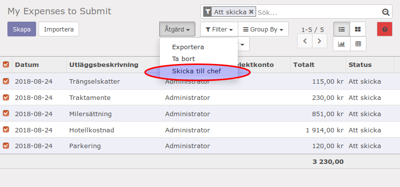

.. _employeeexpense:

==============================
Utlägg med företagets bankkort
==============================
.. toctree::
   :maxdepth: 1

Här visar ett exempel på hur en anställd gör utlägg till sin tjänsresa som betalades med företagets bankkort.
Processen är skapa utlägg -> bekräfta utlägg av sin chef -> skapa verifikat.
Tjänstresan innehåller följande kostnader som betalades med företagets bankkort:
En hotell övernattning
En parkeringavgift

Skapa utlägg
------------

Under meny "Utlägg -> Mina utlägg -> Utlägg att skicka" skapa en nytt utlägg. Välj rätt produkt så namnet fyller Odoo på automatiskt, sätt på datum och fyll i beloppet.
Välj "Företag" under "Betalning till". Spara om allting är korrekt.
Skapa parkeringavgift utlägg med likandan metod som hotell övernattning men välj lämplig produkt.

========================
Utlägg med privata medel
========================
.. toctree::
   :maxdepth: 1

Tjänstresan innehåller följande kostnader som betalades med privata medel:
Milersättning
Traktmente
Trängselskatter

De utläggen gör man på samma sätt som innan, men välj "Anställd (att ersätta)" i "Betalning till".

När alla utlägg är skapades gå tillbaka till listan och kryssa i utläggen som ska skickas till din chef genom att klicka på "Skicka till chef" under knappen "Åtgärd".

