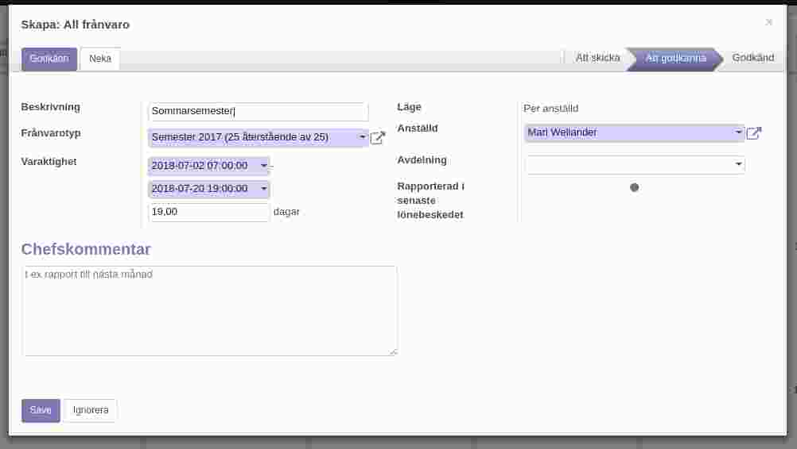

.. _hrindex:

==============
Sjukanmälan och semesteransökan
==============

========================
Ansök om semester
========================

Semesteransökan sker i kalendern på "Frånvaro"-sidan. Här anger man en tidpunkt eller mellar flera datum och typ av frånvaro. Semester finns i form av en eller flera semestersaldon. Det är den anställda som avgör vilken semestersaldo som förbrukas först, vanligvis bör man använda äldst först.

|image0|

Sjukanmälan
=============

Det finns flera typer av frånvaro, det kan handla om sjukdom, föräldraledighet etc. Tillämpas kompledighet visas även denna i form av ett saldo.

Registrering av semestersaldo
===================

Varje år i april vid semesterårets början skapas ett nytt semestersaldo för den anställde. Det här saldo blir då tillgängligt vid semesteransökan.

