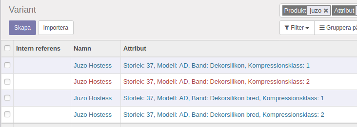
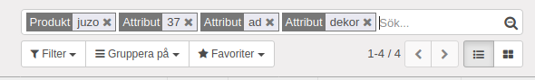
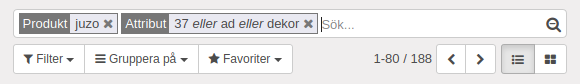

.. _projectindex:

==================
Projektadministration
==================

"Att administrera ett projekt" kan inkludera näst till oändligt många saker. Allt från planering, inköp, inbjudningar till själva genomförandet och traditionsenlig utvärdering. Låt oss i stället begränsa oss till några få händelser.

Projekt
--------------
.. toctree::
   :maxdepth: 1

   biljetter.rst

.. tip::

   Nedan, material och resurser på engelska.

==================
Projektadministration
==================

Project & Task
--------------
.. toctree::
   :maxdepth: 1

   task_from_sales.rst
   default_project_stages.rst
   customer_feedback.rst

Timesheet
---------
.. toctree::
   :maxdepth: 1

   timesheet.rst
   awasome_timesheet.rst

Helpdesk
--------
.. toctree::
   :maxdepth: 1

   service_contract.rst

Customer Portal
---------------
.. toctree::
   :maxdepth: 1

   access_timesheet_on_portal.rst

Varor, produkter
--------------

.. tip::

   Med hjälp av modulen.... kan man göra ett prydligt urval.

Med hjälp av denna modulen kan man lätt får ett fint oc h prydligt urval.

Skriv "juzo", välj "Produkt", tryck Enter. 

Skriv "37", välj "Attribut", tryck Shift + Enter. 

Skriv "ad", välj "Attribut", tryck Shift + Enter. 

Skriv "dekor", välj "Attribut", tryck Shift + Enter. 

Så här blir urvalet i annat fall.

