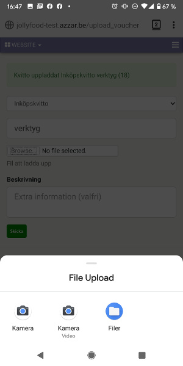
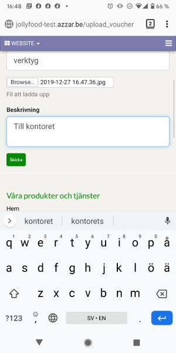
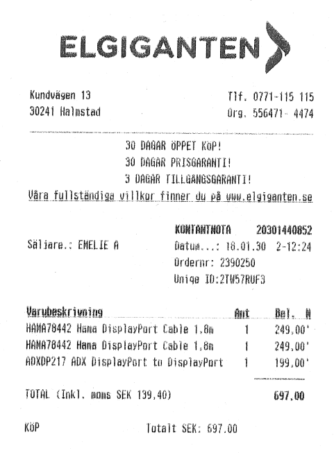

.. _purchaseindex:

===================
Inköp
===================

Inköpsorder skapas normalt från lagerhanteringen (inköp mot lager), tillverkningen (råvarubehov) eller kundorder (kundorderstyrda inköp).

.. toctree::
   :maxdepth: 2

 examination.rst

Inköp av inventarier
--------------------
Exempelvis en dator eller en annan typ av maskin. Börjar att skapa en leverantörsfaktura, ange tillgångskategori Datorer, i överigt som vanligt. Den inköpta dator kommer läggas in som inventarie kommer skrivas av.

.. image:: images/inventarier.png
   :align: center
   
Inköp av förbrukningsvaror (bankkort)
-------------------------------------
Inköpskvitto

.. image:: images/forbruk.png
   :align: center
   
Produkter: förbrukningsvara, it-tjänster, datakommunikation, arbetskläder och skyddsmaterial

Kvittoappen
-----------
Upload_voucher. För att använda funktionen med hantering av kvitton går du till hemsidan.se/upload_voucher där hemsidan är din/er webbplats med Odoo.

Du måste logga in för att kunna använda tjänsten. 

I den först fliken kan man välja vilken typ av vara kvittot rör sig om.

I det andra fältet kan du göra en anteckning om vilken typ av vara / tjänst det kan vara. Sen kan man fota och ladda upp kvittot, direkt in i bokföringen.

Tryck ”Skicka” och då är det klart för dig!

Avancerade exempel
---------------------
.. toctree::
   :maxdepth: 1

   skv560_example_2.rst
   skv560_example_15.rst
   skv560_example_20.rst

