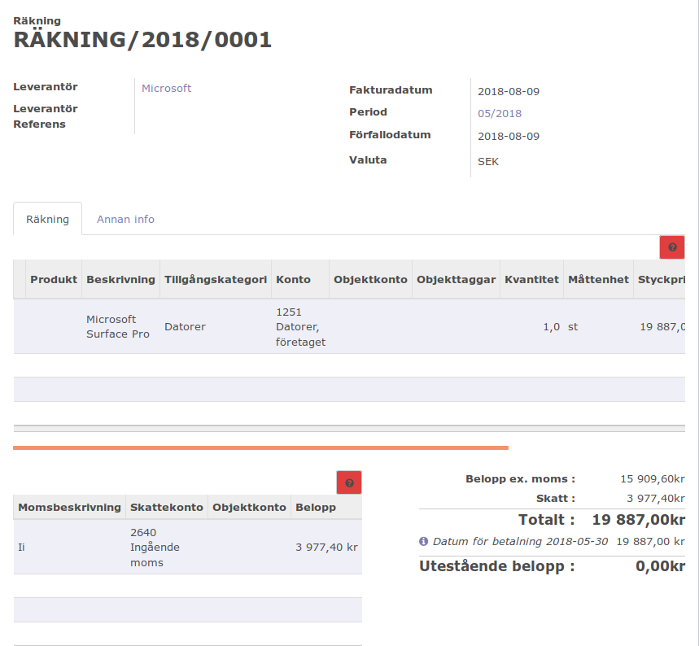
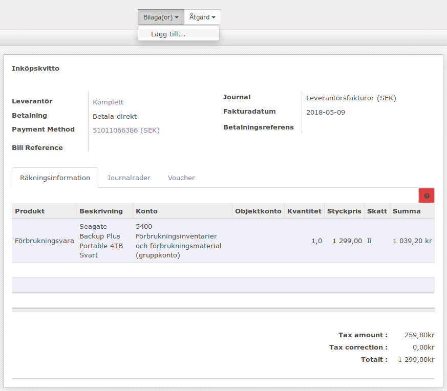

.. _purchaseindex:

===================
Inköp
===================

Inköpsorder skapas normalt från lagerhanteringen (inköp mot lager), tillverkningen (råvarubehov) eller kundorder (kundorderstyrda inköp).

.. toctree::
   :maxdepth: 2

 examination.rst

Inköp av inventarier
--------------------
Exempelvis en dator eller en annan typ av maskin. Börjar att skapa en leverantörsfaktura, ange tillgångskategori Datorer, i överigt som vanligt. Den inköpta dator kommer läggas in som inventarie kommer skrivas av.

   
Inköp av förbrukningsvaror (bankkort)
-------------------------------------
Inköpskvitto

   
Produkter: förbrukningsvara, it-tjänster, datakommunikation, arbetskläder och skyddsmaterial

Avancerade exempel
---------------------
.. toctree::
   :maxdepth: 1

   skv560_example_2.rst
   skv560_example_15.rst
   skv560_example_20.rst

