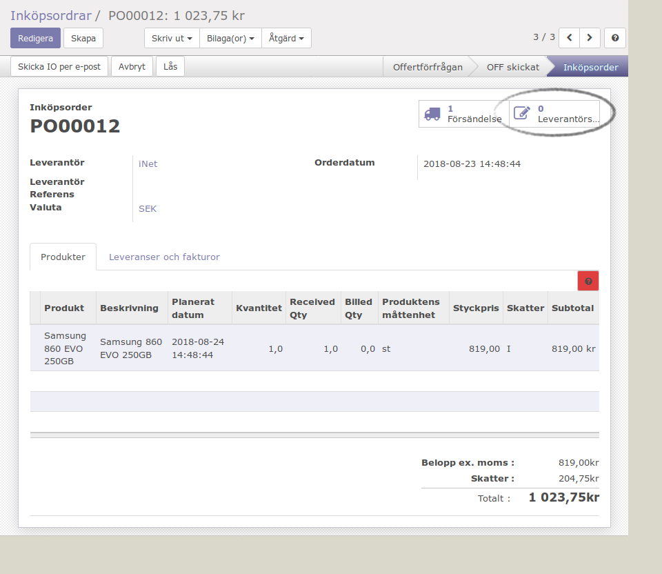

.. _purchaseindex:

===================
Inköp
===================
.. toctree::
   :maxdepth: 1
   
Inköpsorder skapas normalt från lagerhanteringen (inköp mot lager), tillverkningen (råvarubehov) eller kundorder (kundorderstyrda inköp). I dessa fall 

Granskning av leverantörsfakturor
-----------------

Inköpen är ett viktigt underlag för granskning av leverantörsfaktuŕor. Processen är mottagning / granskning leverantörsfaktura -> bekräfta fakturan -> betaluppdrag. Beroende på om leverantörsfakturan gäller ett eller flera inköp finns det två olika metoder. 

Leverantörsfakturan gäller ett inköp
---------

.. image:: images/skapa_leverantorsfaktura.png
   :align: center

Leverantörsfakturan gäller flera inköp
------------------

Avancerade exempel
---------------------
.. toctree::
   :maxdepth: 1

   skv560_example_2.rst

