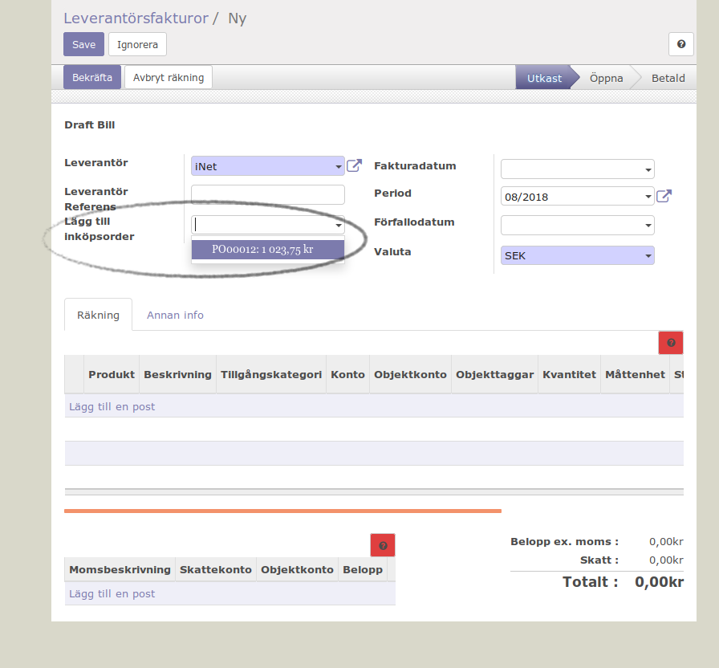

.. _purchaseindex:

===================
Inköp
===================
.. toctree::
   :maxdepth: 1

Inköpsorder skapas normalt från lagerhanteringen (inköp mot lager), tillverkningen (råvarubehov) eller kundorder (kundorderstyrda inköp).

=================
Granskning av leverantörsfakturor
=================

Inköpen är ett viktigt underlag för granskning av leverantörsfakturor. Processen är mottagning / granskning leverantörsfaktura -> bekräfta fakturan -> betaluppdrag. Beroende på om leverantörsfakturan gäller ett eller flera inköp finns det två olika metoder. Har det skett varumottagning så tar Odoo hänsyn till dessa eventuella justeringar vid fakturagranskningen.

Leverantörsfakturan gäller ett inköp
---------

.. image:: images/samfakturering.pngaktura.png
   :align: center

Använd knappen "Leverantörsfakturor" på inköpsordern och skapa en ny faktura, fakturan innehåller uppgifterna från inköpet och kan enkelt jämföras med den verkliga fakturan. Godkänn fakturan om den är korrekt.

Leverantörsfakturan gäller flera inköp
------------------

Avancerade exempel
---------------------
.. toctree::
   :maxdepth: 1

   skv560_example_1.rst
   skv560_example_2.rst
   skv560_example_14.rst
   skv560_example_15.rst
   skv560_example_20.rst

