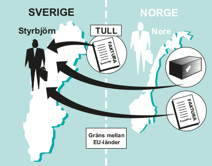

.. _skv560_example_15:

.. index::
   single: Inköp av varor från en plats utanför EU

======================================
Inköp av varor till Sverige från en plats utanför EU (import, SKV 560, exempel 15) 
======================================

Möbelhandlaren Styrbjörn i Sverige köper möbler av Nore
i Norge för 90 000 kr (80 000 NOK vid kursen 112,5000)
exklusive frakt. Styrbjörn betalar 10 000 kr för transporten
från Nore till Sundsvall. Av transportkostnaden avser
8 000 kr transport från införselplatsen i Sverige till
bestämmelseorten Sundsvall.

Tullverket bestämmer det monetära tullvärdet till
92 000 kr (90 000 kr + 2 000 kr).
Eftersom transporten inom Sverige är en bikostnad till
importen uppgår beskattningsunderlaget till 100 000 kr
(92 000 kr + 8 000 kr).

Odoo väljer automatiskt skatteregionen "Handel med världen" eftersom Nore har en adress i Norge. Om leverantören har en adress inom EU eller en adress i Sverige så sker matchningen med respektive skatteområde. Tänk på att Tullverkets beslut om tullvärdet kan kräva en korrigering. (TODO Tull och transporten)

Regionsmatchningen sker i följande steg

1. Matcha land, stat och postkod som är angivet på kundkortet.
2. Matcha land och stat.
3. Matcha land.
4. Matcha landsgrupp.
5. Matcha mot en skatteregion som ej har något av ovanstående krav.

Om Nore av något skäl skulle skatta enligt någon annan modell kan detta beteende överridas genom att ange korrekt skatteområde på kundkortet (rätt skatteområde väljs automnatiskt varje gång) eller specifikt på inköpsorder eller leverantörsfaktura (rätt skatteområde för en enskild transaktion).

Skatteregioner som kräver att saljaren har skatteregistregingsnummer (VAT-nummer) så ingår detta kriterium i regionmatchningen.

