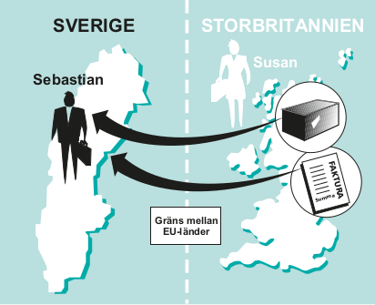
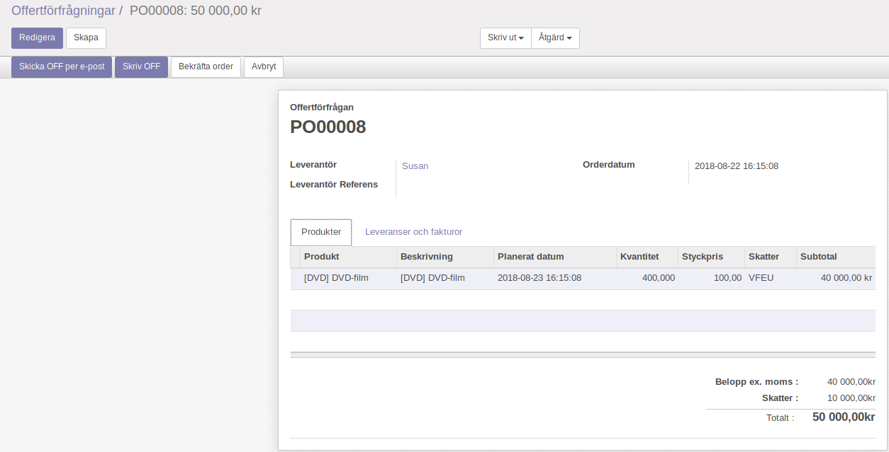
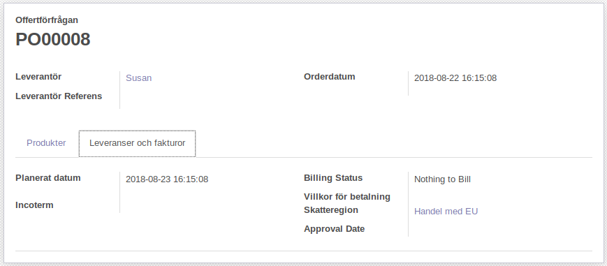
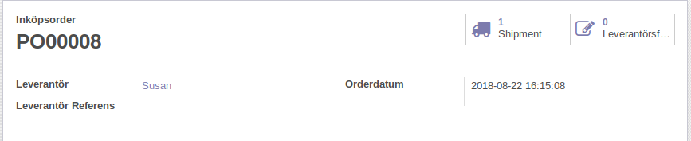
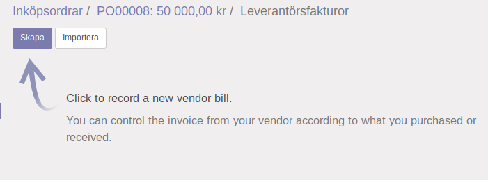
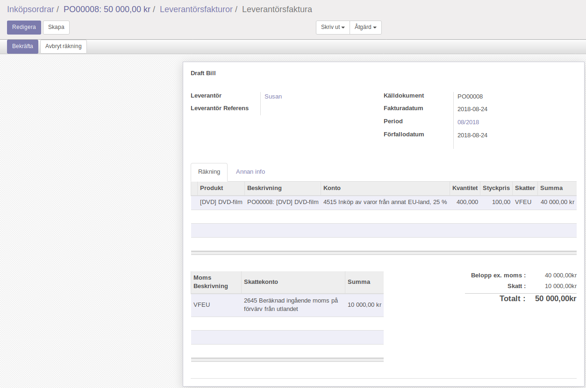

.. _skv560_example_2:

.. index::
   single: Inköp av varor från ett annat EU-land

======================================
Inköp av varor från ett annat EU-land (SKV 560, exempel 2)
======================================

Sebastian i Sverige köper dvd-filmer av Susan i Storbritannien
för 2 450 pund (GBP). Båda är beskattningsbara personer
och är momsregistrerade i respektive hemland. Sebastian
använder bokslutsmetoden vid momsredovisningen. Han
åberopar sitt giltiga momsregistreringsnummer när han
beställer filmerna av Susan. Filmerna transporteras från
Storbritannien till Sverige.

Susan skickar filmerna och utfärdar faktura i mars.
Sebastian får filmerna och fakturan i samma månad. Han
betalar fakturan i april.

Eftersom Sebastian har åberopat ett giltigt moms-
registreringsnummer tar Susan inte ut någon moms i
Storbritannien vid försäljningen. Sebastian gör ett unions-
internt förvärv. Han ska då själv räkna ut och redovisa
momsen på inköpet. Momsen beräknar han på varuvärdet
2 450 GBP som omräknat blir 40 000 kr. Momsen blir
10 000 kr (25 % av 40 000 kr). Eftersom Sebastian ska
sälja filmerna i sin momspliktiga verksamhet får han göra
avdrag för den moms han själv beräknar.

Trots att Sebastian använder bokslutsmetoden vid
momsredovisningen ska han redovisa unionsinterna förvärv
i den period säljaren (Susan) utfärdat fakturan, d.v.s. i
mars. (Om Susan dröjer med att utfärda en faktura måste
Sebastian ändå redovisa momsen senast den 15 i månaden
efter leveransen, d.v.s. den 15 april.)

Inköpsorder
---------------------

Odoo väljer automatiskt skatteregionen "Handel med EU" eftersom Susan har ett skatteregistreringsnummer och en adress i Storbritannien. Om leverantören har en adress utanför EU eller en adress i Sverige så sker matchningen med respektive skatteområde.

Regionsmatchningen sker i följande steg

1. Matcha land, stat och postkod som är angivet på kundkortet.
2. Matcha land och stat.
3. Matcha land.
4. Matcha landsgrupp.
5. Matcha mot en skatteregion som ej har något av ovanstående krav.

Om Susan av något skäl skulle skatta enligt någon annan modell kan detta beteende överridas genom att ange korrekt skatteområde på kundkortet (rätt skatteområde väljs automnatiskt varje gång) eller specifikt på inköpsorder eller leverantörsfaktura (rätt skatteområde för en enskild transaktion).

Skatteregioner som kräver att saljaren har skatteregistregingsnummer (VAT-nummer) så ingår detta kriterium i regionmatchningen.

.. ~ .. image:: skv560/exempel2_6.png
.. ~    :align: center
.. ~ .. image:: skv560/exempel2_7.png
.. ~    :align: center
.. ~ .. image:: skv560/exempel2_8.png
.. ~    :align: center
