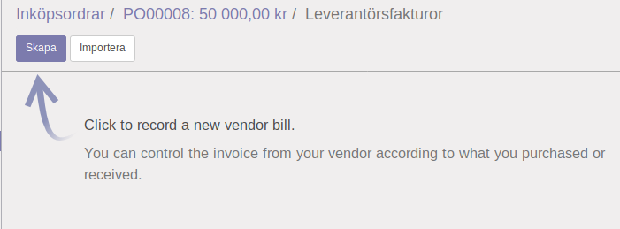
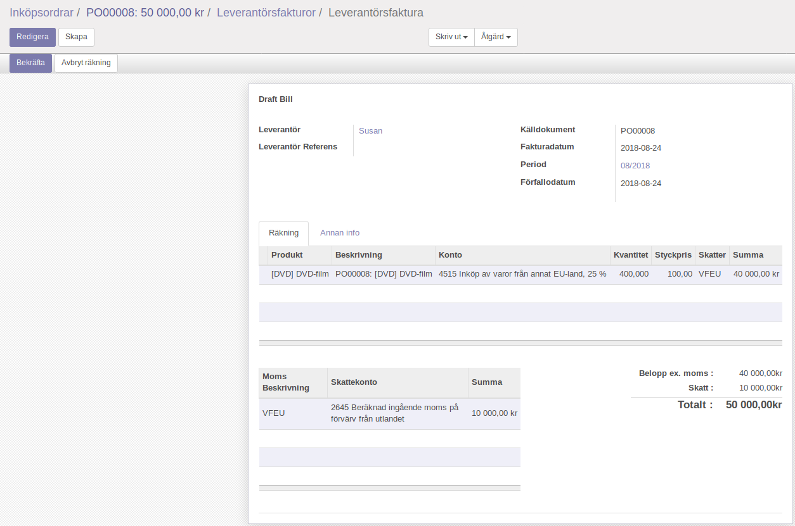

.. _skv560_example_20:

.. index::
   single: Datakonsult i Irland

======================================
Datakonsult i Irland (SKV 560, exempel 20)
======================================

.. image:: skv560/exempel2.png
   :align: center

Sebastian i Sverige köper dvd-filmer av Susan i Storbritannien
för 2 450 pund (GBP). Båda är beskattningsbara personer
och är momsregistrerade i respektive hemland. Sebastian
använder bokslutsmetoden vid momsredovisningen. Han
åberopar sitt giltiga momsregistreringsnummer när han
beställer filmerna av Susan. Filmerna transporteras från
Storbritannien till Sverige.

Susan skickar filmerna och utfärdar faktura i mars.
Sebastian får filmerna och fakturan i samma månad. Han
betalar fakturan i april.

Eftersom Sebastian har åberopat ett giltigt moms-
registreringsnummer tar Susan inte ut någon moms i
Storbritannien vid försäljningen. Sebastian gör ett unions-
internt förvärv. Han ska då själv räkna ut och redovisa
momsen på inköpet. Momsen beräknar han på varuvärdet
2 450 GBP som omräknat blir 40 000 kr. Momsen blir
10 000 kr (25 % av 40 000 kr). Eftersom Sebastian ska
sälja filmerna i sin momspliktiga verksamhet får han göra
avdrag för den moms han själv beräknar.

Trots att Sebastian använder bokslutsmetoden vid
momsredovisningen ska han redovisa unionsinterna förvärv
i den period säljaren (Susan) utfärdat fakturan, d.v.s. i
mars. (Om Susan dröjer med att utfärda en faktura måste
Sebastian ändå redovisa momsen senast den 15 i månaden
efter leveransen, d.v.s. den 15 april.)

Inköpsorder
---------------------
**Inköp** > **Inköp** > **Offertförfrågningar**
**Inköp** > **Inköp** > **Inköpsordrar**

.. image:: skv560/exempel2_1.png
   :align: center
.. image:: skv560/exempel2_2.png
   :align: center

Skapa en ny inköpsorder med skatteregion *Handel med EU*. Om du fyllt i *Land* och *Skatteregistreringsnummer* på kundkortet så kommer rätt skatteregion automatiskt att väljas (se :ref:`_tax_region` för en detaljerad beskrivning).

Fyll i inköpsorderraderna. OBS! Om du byter skatteregion så blir skatten på befintliga rader ej korrekt. Du kan tvinga en uppdatering av en rad genom att byta produkt på den.

Bekräfta ordern.

.. image:: skv560/exempel2_3.png
   :align: center

Klicka på knappen *Leverantörsfakturor* som dök upp när du godkände ordern.

Skapa en ny faktura.

En ny faktura har nu skapats utifrån inköpsordern. Kontrollera mot fakturan som du fått av leverantören och godkänn.

.. ~ .. image:: skv560/exempel2_6.png
.. ~    :align: center
.. ~ .. image:: skv560/exempel2_7.png
.. ~    :align: center
.. ~ .. image:: skv560/exempel2_8.png
.. ~    :align: center
