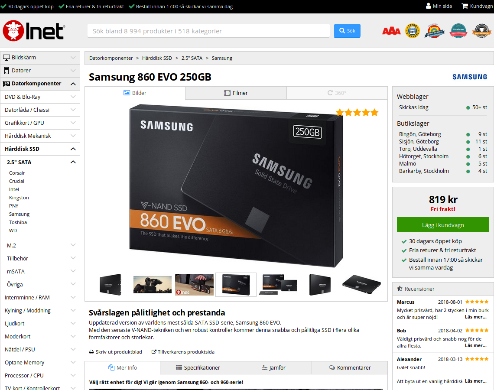
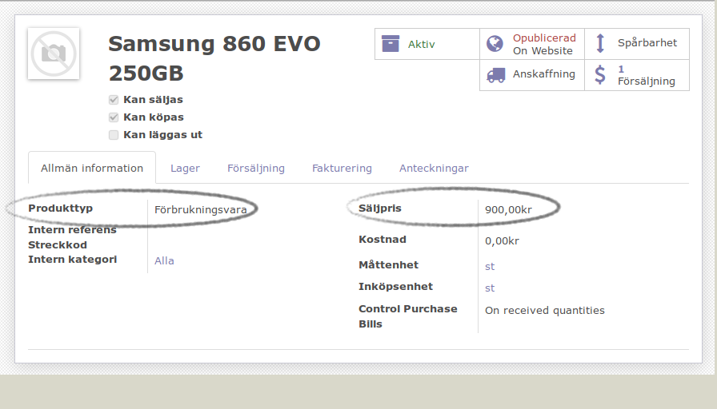
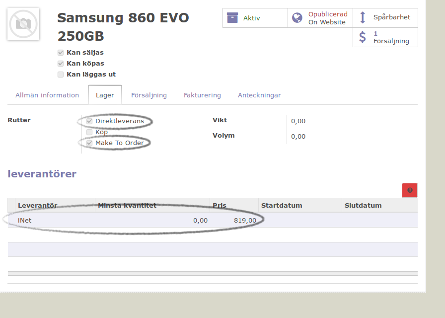
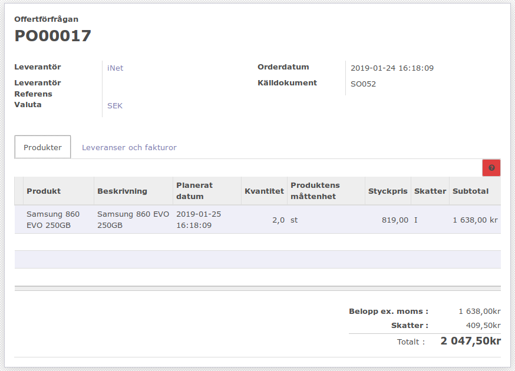
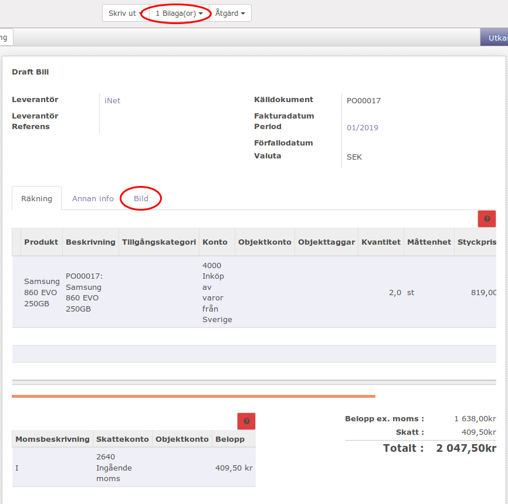
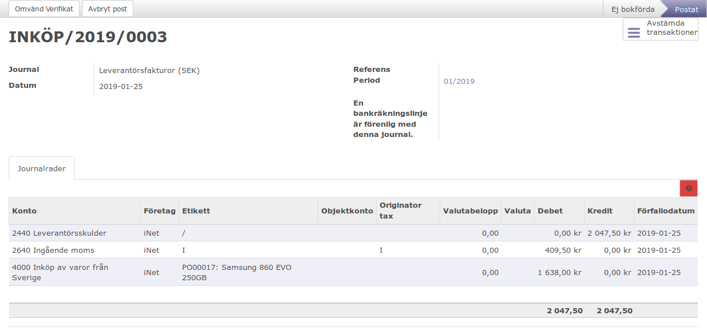

.. _salesindex:

=========================
Vidareförsäljning av produkter köpta i webbutik
=========================

I detta exempel gör vi ett inköp av produkter som vi normalt inte lagerför som skall skickas direkt till kund. Produkterna skall faktureras och leverantörsfakturan skall kunna granskas när den kommer.

Kundorder
---------

Börjar med att skapa en kundorder, ange kund som vanligt. Skapa orderrader, i ett seperat fönster surfa in till din leverantör och välj ut produkter.

Skapa produkt
-------------

Skapa en ny produkt, direkt från orderformuläret. Klistra in lämpliga uppgifter från webbutiken. Ange produkttypen: Förbrukningsvara och sätt säljpris till det pris du vill debitera din kund.

I fliken lager, kryssa direktleverans och make to order. Lägg in din leverantör och ditt inköpspris.

Ibland kan man behöva läsa in produkten på nytt för att vara säker på att alla nya uppgifter är inlästa på orderraden.
Kunderorderen kan se exempelvis såhär:

.. image:: dropshipping_new/kundorder.png
   :align: center

Nu kan kunden få sin order och faktura i vanlig ordning. En inköpsorder är skapad som används i samband med granskning av leverantörsfakturan när det anländer.
Inköpsorderen kan se exempelvis såhär:

Efter varorn har kommit klick på "Ta emot produkter", nu kan du skapa en leverantörsfaktura genom att klicka på knappen "Leverantörsfaktura".
Skanna och ladda upp fakturan som du fick från leverantörn. På "Bild" fliken kan du granska om produktraderna och raderna på bilden är överstämma varandra.

Bekräfta leverantörsfakturan efteråt så skapar Odoo en verifikat utifrån det.

